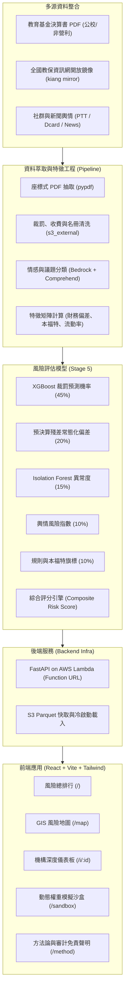

# 小小守護員 (Smart Watchdog)

> **新北市幼兒園財務公開資料審計與智慧風險預警平台**  
> 獲取公開教育基金決算、歷史裁罰與外部社群信號，將幼兒園稽查機制由「被動檢舉」轉化為「主動預警」。

---

## 專案背景與目標

地方教育發展基金每年編列龐大預算支持公立與非營利幼兒園營運，然而過去多仰賴事後陳情與定期抽查，難以在第一時間發現隱匿的人力不足、預算挪用或異常營運風險。

**小小守護員 (Smart Watchdog)** 專為主管機關與稽查人員設計，透過多源資料融合與可解釋性 AI 技術，建立透明、量化且具因果推論依據的決策支援系統（Decision Support System）：
- **精準預警**：結合 11/38 非營利園已知歷史裁罰事實，驗證「用人費用嚴重不足（Understaffing）」與違規事實的高度關聯。
- **透明可解釋**：每一分風險評分皆能拆解至具體的 SHAP 特徵貢獻度、違反法規歷程或原始財務報表頁碼。
- **地理色階地圖**：以 GIS 圖層直觀呈現新北市各區幼兒園之風險分佈，輔助有限稽查人力之排程調度。

---

## 系統架構



---

## 綜合風險評分模型

綜合風險指數以 0–100 分量化呈現，並落實於 `config.yaml` 權重配置：

$$\text{Risk Score} = 100 \times \Big( 0.45 \cdot P_{\text{penalty}} + 0.20 \cdot \text{Norm}(Z_{\text{residual}}) + 0.15 \cdot \text{Score}_{\text{iso}} + 0.10 \cdot \text{Risk}_{\text{opinion}} + 0.10 \cdot \sum W_{\text{flag}} \Big)$$

- **$P_{\text{penalty}}$ (45%)**：XGBoost 監督式模型預測未來學年度裁罰機率。
- **$Z_{\text{residual}}$ (20%)**：決算數相對於預算數與同儕規模的統計偏離度。
- **$\text{Score}_{\text{iso}}$ (15%)**：針對無裁罰歷史機構（如市立園）之無監督孤立森林異常指標。
- **$\text{Risk}_{\text{opinion}}$ (10%)**：外部社群在餐食衛生、不當管教、收費爭議等 6 大面向之情感風險，具備明確「無輿情資料」揭露。
- **$\sum W_{\text{flag}}$ (10%)**：本福特定律異常、用人費用嚴重不足、受託營運單位頻繁更換等專業查核旗標。

---

## 專案目錄結構

```text
.
├── config.yaml               # 系統全域設定 (AWS 區域、S3 前綴、模型權重)
├── Makefile                  # 一鍵安裝、測試與啟動指令
├── requirements.txt          # Python 後端與管線相依套件
├── infra/                    # 雲端基礎架構管理
│   ├── bootstrap.py          # AWS 環境檢測與資源初始化 CLI
│   └── deploy_api.py         # Lambda Function URL 打包與自動化部署
├── api/                      # 後端 API 服務 (FastAPI)
│   ├── main.py               # FastAPI 應用實例與 CORS 設定
│   ├── handler.py            # AWS Lambda Mangum 進入點
│   ├── config.py             # 設定檔讀取介面
│   ├── schemas.py            # Pydantic 資料契約與型別規範
│   └── routes/               # API 路由模組 (health, institutions, rankings...)
├── pipeline/                 # 資料解析、特徵工程與機器學習 (骨架)
│   ├── common/               # PDF 表格萃取、民國學年轉換、會計科目 mapping
│   └── nlp/                  # 輿情擷取、實體對齊與議題極性分類
└── web/                      # 前端單頁應用 (React + Vite + Tailwind + TypeScript)
    ├── src/
    │   ├── App.tsx           # 路由配置與導航
    │   ├── types/api.ts      # 前端 TypeScript API 介面型別
    │   ├── services/api.ts   # API Client 請求封裝
    │   ├── components/       # 通用佈局 (Navbar, Layout)
    │   └── pages/            # 頁面 (Ranking, RiskMap, Detail, Sandbox, Methodology)
    └── vite.config.ts        # Vite 設定與後端 Proxy
```

---

## 快速開始 (Quick Start)

### 1. 環境需求
- **Node.js**: 20+ (含 npm)
- **Python**: 3.10+

### 2. 安裝相依套件

```bash
# 建立並啟用 Python 虛擬環境
python3 -m venv .venv
source .venv/bin/activate

# 安裝後端核心套件
pip install -r requirements.txt

# 安裝前端套件
cd web && npm install && cd ..
```

亦可直接使用 Makefile：
```bash
make install-backend
make install-frontend
```

### 3. 本地端服務啟動

- **後端 API 伺服器 (FastAPI)**：
  ```bash
  make run-backend
  # 服務將啟動於 http://localhost:8000
  # API 互動文件位於 http://localhost:8000/docs
  ```

- **前端開發伺服器 (Vite)**：
  ```bash
  make run-frontend
  # 應用將啟動於 http://localhost:5173
  ```

### 4. 驗證與檢查

```bash
# 檢查 AWS 連線與基礎環境配置
make check-backend

# 前端靜態資源編譯測試
make build-frontend
```

---

## 🔍 輿情爬蟲與 Bedrock 模型分析使用方式 (Opinion Crawler & Bedrock Inference)

輿情分析模組整合多源網路爬蟲（Google News RSS、PTT 媽寶板、Dcard 親子板）、實體消歧義對齊，並透過 **Amazon Bedrock (Claude 3 Haiku)** 進行 6 大法規風險議題分類與情緒極性計算，最終透過時間指數衰減算出機構輿情風險指數（`opinion_risk`，0–100 分）。

### 1. 透過 CLI 獨立執行即時爬取與分析

使用 Python 模組直接對指定幼兒園發動多源爬蟲與評分：

```bash
# 啟用虛擬環境
source .venv/bin/activate

# 執行北大非營利幼兒園端對端爬取與分析
python3 -m pipeline.nlp.service --name "新北市北大非營利幼兒園" --id "N07" --district "三峽區"

# 或直接使用 Makefile 捷徑
make test-opinion-crawler
```

**CLI 輸出範例**：
```json
{
  "inst_id": "N07",
  "inst_name": "新北市北大非營利幼兒園",
  "opinion_risk": 0.0,
  "coverage": 4,
  "has_opinion": true,
  "topic_distribution": {
    "無特定風險/一般討論": 4
  },
  "documents": [
    {
      "id": "gnews_...",
      "source": "google_news",
      "title": "北大非營利幼兒園揭牌...",
      "published_date": "2017-11-17",
      "topic": "無特定風險/一般討論",
      "polarity": 0.1,
      "snippet": "社群一般提及"
    }
  ]
}
```

### 2. 透過 REST API 觸發即時爬取與計算

啟動後端伺服器後（`make run-backend`），可透過 HTTP 呼叫觸發：

#### A. 查詢已建檔機構並強制即時爬取 (`GET`)
```bash
curl -X GET "http://localhost:8000/api/opinion/N07?crawl=true"
```

#### B. 自訂任意機構名稱即時爬取分析 (`POST`)
```bash
curl -X POST "http://localhost:8000/api/opinion/analyze" \
     -H "Content-Type: application/json" \
     -d '{
       "name": "新北市安興非營利幼兒園",
       "district": "新店區"
     }'
```

### 3. AWS Bedrock 模型配置與環境變數

- **設定檔位置**：[`config.yaml`](config.yaml)
  ```yaml
  aws:
    region: us-west-2
    profile_name: workshop   # AWS 具名 Profile
  ```
- **使用模型**：預設為 `us.anthropic.claude-haiku-4-5-20251001-v1:0`（inference profile），可由環境變數 `BEDROCK_MODEL_ID` 覆寫。
- **高可用備援機制 (Fallback)**：
  - 若執行環境未配置 AWS 憑證或尚未開通 Bedrock 模型權限，系統會自動在終端印出警告，並**無縫切換為本地規則與關鍵詞詞典分類模式（Rule-based Fallback）**，保證本機離線與測試流程不中斷。

---

## 風險評估及處理彙總表 (官方格式文件報告)

模型輸出可直接產製為符合**教育部風險管理推動作業原則**之正式文件報告，供稽查人員列印、簽陳或匯出。格式對應原則之附件二（風險可能性／影響程度評量標準表）、附件三（風險判斷基準及其風險容忍度）、附件四（現有(殘餘)風險圖像）與附件七（風險評估及處理彙總表）。

### 1. 級距與判斷基準

- 風險值 **R = 可能性(L) × 影響程度(I)**，L 與 I 皆為 1～3 級。
- 風險容忍度：**R ≤ 4 予以容忍**；R = 6（高度風險）與 R = 9（極度風險）為不可容忍風險，須研擬新增風險對策。
- 官方級距與處理策略集中定義於 [`api/risk_matrix.py`](api/risk_matrix.py)，模型分數換算為 L / I 的門檻集中於 [`api/services/report_builder.py`](api/services/report_builder.py)：

  | 模型訊號 | 換算後可能性(L) |
  | --- | --- |
  | 裁罰機率或嚴重度 ≥ 0.50，或近年裁罰 ≥ 2 件 | 3（幾乎確定） |
  | 裁罰機率或嚴重度 ≥ 0.20，或近年裁罰 ≥ 1 件 | 2（可能） |
  | 其餘 | 1（幾乎不可能） |

  影響程度(I) 取自風險項目目錄之基準值（如體罰、餐食衛生、設施安全為 3），並於嚴重度 ≥ 0.75 或裁罰 ≥ 2 件時上調一級；殘餘風險採保守假設，僅由新增對策降低可能性一級。

### 2. 後端 API

```bash
# 附件二、附件三級距與空白風險圖像
curl "http://localhost:8000/api/report/scales"

# 單一機構彙總表（demo=true 回傳示範資料，meta.is_sample 為 true）
curl "http://localhost:8000/api/report/N07?academic_year=112&demo=true"

# 由管線／模型輸出直接產製報表
curl -X POST "http://localhost:8000/api/report/build" \
     -H "Content-Type: application/json" \
     -d '{
       "inst_id": "N15",
       "inst_name": "新北市新月非營利幼兒園",
       "academic_year": 112,
       "signals": [
         {"code": "UNDERSTAFFING", "p_penalty": 0.62, "severity": 0.71, "penalty_count": 1},
         {"code": "OPINION_設施安全", "severity": 0.82}
       ]
     }'
```

### 3. 前端頁面

- 路徑：`/report/:id`，可自機構詳情頁點擊「產製風險彙總表」進入。
- 頁面欄位完整對應附件七：項次、年度施政目標、重要計畫項目、風險項目、風險情境、現有風險對策、現有風險等級（可能性(L)／影響程度(I)）、現有風險值(R)=(L)×(I)、新增風險對策、殘餘風險等級（可能性(L)／影響程度(I)）、殘餘風險值(R)=(L)×(I)、主辦單位。
- 每一列可展開**模型佐證**（SHAP 貢獻度、裁罰文號、決算書頁碼、輿情來源 URL），確保風險等級可回溯。
- 支援 **列印／另存 PDF（A4 橫式，保留附件四色階）**、**匯出 CSV（含 BOM，Excel 可直開）** 與 **匯出 JSON**。

---

## 全市風險評估綜整報告

路徑 `/report`（等同 `/report/city`），亦可自風險排行頁點擊「產製綜整報告」進入。將全站數據收斂為一份可簽陳、可列印的年度報告，第柒章自動展開所有高風險機構的專案報告。

### 報告結構

| 章節 | 內容 |
| --- | --- |
| 壹、執行摘要 | Bedrock 生成之摘要與 3 條關鍵發現，另列 5 項關鍵指標；文字來源以標籤標示 |
| 貳、評估範圍與資料可信度 | 資料來源、PDF 解析驗證率、輿情涵蓋率、資料更新時間 |
| 參、風險分布總覽 | 風險等級分布、同儕群組對比、行政區熱點前 5、分數分布直方圖 |
| 肆、全市風險圖像 | 附件四 3×3 矩陣，標示各園落點 |
| 伍、風險因子拆解 | 旗標依人力／財務／治理／設施分類統計，裁罰與分數之一致性 |
| 陸、稽查資源配置建議 | Bedrock 建議＋依附件三判斷基準與地理群聚之排程建議 |
| 柒、高風險機構專案報告 | 分數 ≥60 之機構逐所展開：定位、旗標、附件七列、建議查核重點 |
| 捌、模型方法論與使用限制 | 評分公式、AUC／Macro-F1／Parser 驗證率、免責聲明 |
| 玖、附錄 | 全機構風險評分明細表 |

### 等級換算規則

報告以 0–100 分為主體，換算至教育部風險值時採下列對照（與 `api/services/report_builder.py` 一致）：

| 換算項目 | 規則 |
| --- | --- |
| 可能性(L) | 風險分數 ≥60 → 3、30–59 → 2、<30 → 1 |
| 影響程度(I) | 歷史裁罰 ≥2 件 → 3、1 件 → 2、無 → 1 |
| 風險值(R) | L × I，R ≤ 4 為可容忍風險 |

### 敘述文字生成

```bash
# Bedrock 生成（憑證失效或模型未開通時，後端自動退回規則模板）
curl -X POST "http://localhost:8000/api/report/city/narrative" \
     -H "Content-Type: application/json" \
     -d '{"total_institutions":14,"average_score":45.8,"high_risk_count":5,"total_penalties":12,
          "peer_groups":[{"peer_group":"非營利園","count":10,"average_score":55.0,"max_score":78.5,"penalty_count":12}],
          "top_districts":[{"district":"三峽區","count":1,"average_score":78.5,"max_score":78.5}],
          "opinion_coverage":0.35}'

# 強制使用規則模板（離線 Demo）
# 於上述 JSON 加入 "use_bedrock": false
```

回應中的 `generated_by` 為 `bedrock` 或 `template`，前端據此於報告上標示文字來源；提示詞明確限制模型只得引用傳入數字、不得推論違法事實。

### 資料源

14 園評分資料集中於 `web/src/data/institutions.ts`（風險地圖與綜整報告共用），統計計算集中於 `web/src/services/cityReport.ts`。待 Stage 5 分數落地後，改由 `/api/institutions` 取得即可，頁面無需改寫。

---

## ⚠️ 免責與使用限制聲明
