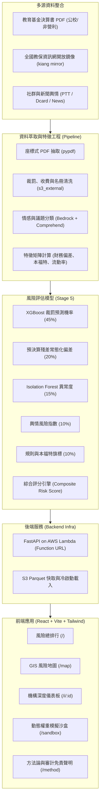

# 小小守護員 (Smart Watchdog)

> **新北市幼兒園財務公開資料審計與智慧風險預警平台**  
> 獲取公開教育基金決算、歷史裁罰與外部社群信號，將幼兒園稽查機制由「被動檢舉」轉化為「主動預警」。

---

## 專案背景與目標

地方教育發展基金每年編列龐大預算支持公立與非營利幼兒園營運，然而過去多仰賴事後陳情與定期抽查，難以在第一時間發現隱匿的人力不足、預算挪用或異常營運風險。

**小小守護員 (Smart Watchdog)** 專為主管機關與稽查人員設計，透過多源資料融合與可解釋性 AI 技術，建立透明、量化且具因果推論依據的決策支援系統（Decision Support System）：
- **精準預警**：結合 11/38 非營利園已知歷史裁罰事實，驗證「用人費用嚴重不足（Understaffing）」與違規事實的高度關聯。
- **透明可解釋**：每一分風險評分皆能拆解至具體的 SHAP 特徵貢獻度、違反法規歷程或原始財務報表頁碼。
- **地理色階地圖**：以 GIS 圖層直觀呈現新北市各區幼兒園之風險分佈，輔助有限稽查人力之排程調度。

---

## 系統架構



---

## 綜合風險評分模型

綜合風險指數以 0–100 分量化呈現，並落實於 `config.yaml` 權重配置：

$$\text{Risk Score} = 100 \times \Big( 0.45 \cdot P_{\text{penalty}} + 0.20 \cdot \text{Norm}(Z_{\text{residual}}) + 0.15 \cdot \text{Score}_{\text{iso}} + 0.10 \cdot \text{Risk}_{\text{opinion}} + 0.10 \cdot \sum W_{\text{flag}} \Big)$$

- **$P_{\text{penalty}}$ (45%)**：XGBoost 監督式模型預測未來學年度裁罰機率。
- **$Z_{\text{residual}}$ (20%)**：決算數相對於預算數與同儕規模的統計偏離度。
- **$\text{Score}_{\text{iso}}$ (15%)**：針對無裁罰歷史機構（如市立園）之無監督孤立森林異常指標。
- **$\text{Risk}_{\text{opinion}}$ (10%)**：外部社群在餐食衛生、不當管教、收費爭議等 6 大面向之情感風險，具備明確「無輿情資料」揭露。
- **$\sum W_{\text{flag}}$ (10%)**：本福特定律異常、用人費用嚴重不足、受託營運單位頻繁更換等專業查核旗標。

---

## 專案目錄結構

```text
.
├── config.yaml               # 系統全域設定 (AWS 區域、S3 前綴、模型權重)
├── Makefile                  # 一鍵安裝、測試與啟動指令
├── requirements.txt          # Python 後端與管線相依套件
├── infra/                    # 雲端基礎架構管理
│   ├── bootstrap.py          # AWS 環境檢測與資源初始化 CLI
│   └── deploy_api.py         # Lambda Function URL 打包與自動化部署
├── api/                      # 後端 API 服務 (FastAPI)
│   ├── main.py               # FastAPI 應用實例與 CORS 設定
│   ├── handler.py            # AWS Lambda Mangum 進入點
│   ├── config.py             # 設定檔讀取介面
│   ├── schemas.py            # Pydantic 資料契約與型別規範
│   └── routes/               # API 路由模組 (health, institutions, rankings...)
├── pipeline/                 # 資料解析、特徵工程與機器學習 (骨架)
│   ├── common/               # PDF 表格萃取、民國學年轉換、會計科目 mapping
│   └── nlp/                  # 輿情擷取、實體對齊與議題極性分類
└── web/                      # 前端單頁應用 (React + Vite + Tailwind + TypeScript)
    ├── src/
    │   ├── App.tsx           # 路由配置與導航
    │   ├── types/api.ts      # 前端 TypeScript API 介面型別
    │   ├── services/api.ts   # API Client 請求封裝
    │   ├── components/       # 通用佈局 (Navbar, Layout)
    │   └── pages/            # 頁面 (Ranking, RiskMap, Detail, Sandbox, Methodology)
    └── vite.config.ts        # Vite 設定與後端 Proxy
```

---

## 快速開始 (Quick Start)

### 1. 環境需求
- **Node.js**: 20+ (含 npm)
- **Python**: 3.10+

### 2. 安裝相依套件

```bash
# 建立並啟用 Python 虛擬環境
python3 -m venv .venv
source .venv/bin/activate

# 安裝後端核心套件
pip install -r requirements.txt

# 安裝前端套件
cd web && npm install && cd ..
```

亦可直接使用 Makefile：
```bash
make install-backend
make install-frontend
```

### 3. 本地端服務啟動

- **後端 API 伺服器 (FastAPI)**：
  ```bash
  make run-backend
  # 服務將啟動於 http://localhost:8000
  # API 互動文件位於 http://localhost:8000/docs
  ```

- **前端開發伺服器 (Vite)**：
  ```bash
  make run-frontend
  # 應用將啟動於 http://localhost:5173
  ```

### 4. 驗證與檢查

```bash
# 檢查 AWS 連線與基礎環境配置
make check-backend

# 前端靜態資源編譯測試
make build-frontend
```

---

## 🔍 輿情爬蟲與 Bedrock 模型分析使用方式 (Opinion Crawler & Bedrock Inference)

輿情分析模組整合多源網路爬蟲（Google News RSS、PTT 媽寶板、Dcard 親子板）、實體消歧義對齊，並透過 **Amazon Bedrock (Claude 3 Haiku)** 進行 6 大法規風險議題分類與情緒極性計算，最終透過時間指數衰減算出機構輿情風險指數（`opinion_risk`，0–100 分）。

### 1. 透過 CLI 獨立執行即時爬取與分析

使用 Python 模組直接對指定幼兒園發動多源爬蟲與評分：

```bash
# 啟用虛擬環境
source .venv/bin/activate

# 執行北大非營利幼兒園端對端爬取與分析
python3 -m pipeline.nlp.service --name "新北市北大非營利幼兒園" --id "N07" --district "三峽區"

# 或直接使用 Makefile 捷徑
make test-opinion-crawler
```

**CLI 輸出範例**：
```json
{
  "inst_id": "N07",
  "inst_name": "新北市北大非營利幼兒園",
  "opinion_risk": 0.0,
  "coverage": 4,
  "has_opinion": true,
  "topic_distribution": {
    "無特定風險/一般討論": 4
  },
  "documents": [
    {
      "id": "gnews_...",
      "source": "google_news",
      "title": "北大非營利幼兒園揭牌...",
      "published_date": "2017-11-17",
      "topic": "無特定風險/一般討論",
      "polarity": 0.1,
      "snippet": "社群一般提及"
    }
  ]
}
```

### 2. 透過 REST API 觸發即時爬取與計算

啟動後端伺服器後（`make run-backend`），可透過 HTTP 呼叫觸發：

#### A. 查詢已建檔機構並強制即時爬取 (`GET`)
```bash
curl -X GET "http://localhost:8000/api/opinion/N07?crawl=true"
```

#### B. 自訂任意機構名稱即時爬取分析 (`POST`)
```bash
curl -X POST "http://localhost:8000/api/opinion/analyze" \
     -H "Content-Type: application/json" \
     -d '{
       "name": "新北市安興非營利幼兒園",
       "district": "新店區"
     }'
```

### 3. AWS Bedrock 模型配置與環境變數

- **設定檔位置**：[`config.yaml`](config.yaml)
  ```yaml
  aws:
    region: us-west-2
    profile_name: workshop   # AWS 具名 Profile
  ```
- **使用模型**：預設為 `anthropic.claude-3-haiku-20240307-v1:0`。
- **高可用備援機制 (Fallback)**：
  - 若執行環境未配置 AWS 憑證或尚未開通 Bedrock 模型權限，系統會自動在終端印出警告，並**無縫切換為本地規則與關鍵詞詞典分類模式（Rule-based Fallback）**，保證本機離線與測試流程不中斷。

---

## ⚠️ 免責與使用限制聲明
