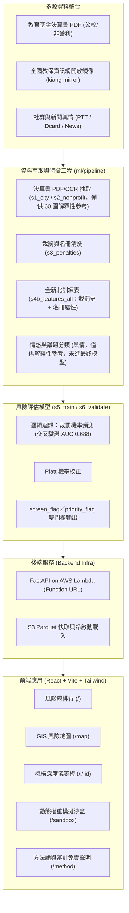

# 小小守護員 (Smart Watchdog)

> **新北市幼兒園財務公開資料審計與智慧風險預警平台**  
> 獲取公開教育基金決算、歷史裁罰與外部社群信號，將幼兒園稽查機制由「被動檢舉」轉化為「主動預警」。

---

## 專案背景與目標

地方教育發展基金每年編列龐大預算支持公立與非營利幼兒園營運，然而過去多仰賴事後陳情與定期抽查，難以在第一時間發現隱匿的人力不足、預算挪用或異常營運風險。

**小小守護員 (Smart Watchdog)** 專為主管機關與稽查人員設計，透過多源資料融合與可解釋性 AI 技術，建立透明、量化且具因果推論依據的決策支援系統（Decision Support System）：
- **精準預警**：結合 11/38 非營利園已知歷史裁罰事實，驗證「用人費用嚴重不足（Understaffing）」與違規事實的高度關聯。
- **透明可解釋**：每一分風險評分皆能拆解至具體的 SHAP 特徵貢獻度、違反法規歷程或原始財務報表頁碼。
- **地理色階地圖**：以 GIS 圖層直觀呈現新北市各區幼兒園之風險分佈，輔助有限稽查人力之排程調度。

---

## 系統架構



---

## 風險評分模型

> 本節反映 `ml/docs/MODEL_REPORT.md` 的實測結論，與最初設計的多因子加權構想不同——請見下方「與原始設計的差異」。

最終上線模型是**邏輯迴歸**，只用「裁罰歷史 + 名冊屬性」10 個特徵（過去裁罰次數、當年是否被罰、距上次裁罰年數、核定人數、月費、立案年數、私立、非營利、延長照顧、準公共化），預測園所下一學年度被裁罰的機率，再以 Platt scaling 校正為實際機率：

- **交叉驗證 AUC 0.688**（95% CI 0.666–0.707），時間外推（2023–2024 測試）AUC 0.640。
- 輸出兩種門檻：`priority_flag`（每年前 10% 優先稽查，precision 約為隨機的 2.2 倍）與 `screen_flag`（召回 90% 的廣泛篩檢名單）。
- 訓練與推論程式：[`ml/pipeline/s5_train.py`](ml/pipeline/s5_train.py)、[`ml/pipeline/s6_validate.py`](ml/pipeline/s6_validate.py)，產出 [`ml/data/processed/risk_scores_latest.csv`](ml/USAGE.md)（不隨 repo 散佈，需在本機重跑產生）。

### 與原始設計的差異

專案初期規劃了一套 5 因子加權的「綜合風險指數」（裁罰機率 45% + 預決算殘差 20% + Isolation Forest 異常度 15% + 輿情風險 10% + 規則旗標 10%，仍保留於 `config.yaml` 的 `model.weights` 與 `api/services/report_builder.py` 供 API/前端展示欄位使用）。但實測後：

- **財報殘差**：60 間公共化園的決算書逐列 OCR 解析後，與隔年裁罰**無統計關聯**（AUC 0.44–0.49），假設不成立，故未納入最終模型。
- **輿情風險**：新聞、PTT、Dcard 等公開/合規來源幾乎不點名園所（AUC 0.50–0.51，等同隨機），且多數社群平台條款不允許爬取，資料量不足以支撐模型。
- **雙模型加權實驗**：財報+輿情模型與裁罰史模型以第二層模型學權重，混合後**沒有提升**，因此最終模型排除財報與輿情訊號。
- 目前 API 回傳的 `residual`、`isolation_forest` 欄位（[`api/services/institution_store.py`](api/services/institution_store.py)）在動態資料來源下是以 `risk_probability` 的固定比例換算的展示用途值，並非獨立計算的殘差或孤立森林分數。

詳細方法論、資料規模與混淆矩陣見 [`ml/docs/MODEL_REPORT.md`](ml/docs/MODEL_REPORT.md)。

---

## 專案目錄結構

```text
.
├── config.yaml               # 系統全域設定 (AWS 區域、S3 前綴、模型權重)
├── Makefile                  # 一鍵安裝、測試與啟動指令
├── requirements.txt          # Python 後端與管線相依套件
├── infra/                    # 雲端基礎架構管理
│   ├── bootstrap.py          # AWS 環境檢測與資源初始化 CLI
│   └── deploy_api.py         # Lambda Function URL 打包與自動化部署
├── api/                      # 後端 API 服務 (FastAPI)
│   ├── main.py               # FastAPI 應用實例與 CORS 設定
│   ├── handler.py            # AWS Lambda Mangum 進入點
│   ├── config.py             # 設定檔讀取介面
│   ├── schemas.py            # Pydantic 資料契約與型別規範
│   └── routes/               # API 路由模組 (health, institutions, rankings...)
├── pipeline/                 # API 直接呼叫的輿情爬蟲模組
│   ├── common/               # (骨架，目前為空)
│   └── nlp/                  # 輿情擷取、實體對齊與議題極性分類 (Bedrock)
├── ml/                       # 風險預測模型：資料清洗、特徵工程、訓練與驗證
│   ├── pipeline/
│   │   ├── common/           # PDF/OCR 抽取、民國學年轉換、名冊與詞彙表 (roc.py, ocr.py, roster.py)
│   │   ├── nlp/               # 輿情蒐集與分類訓練 (僅供解釋性參考)
│   │   ├── s1_city.py ~ s4b_features_all.py  # 財報解析與特徵表建置
│   │   └── s5_train.py, s6_validate.py       # 模型訓練、交叉驗證、產出風險分數
│   ├── data/                 # 原始/處理後資料與標籤 (git-ignored，需本機產生)
│   ├── docs/MODEL_REPORT.md  # 模型方法論、AUC 與資料充足度分析
│   └── USAGE.md              # 重跑模型與整合到 API 的操作說明
└── web/                      # 前端單頁應用 (React + Vite + Tailwind + TypeScript)
    ├── src/
    │   ├── App.tsx           # 路由配置與導航
    │   ├── types/api.ts      # 前端 TypeScript API 介面型別
    │   ├── services/api.ts   # API Client 請求封裝
    │   ├── components/       # 通用佈局 (Navbar, Layout)
    │   └── pages/            # 頁面 (Ranking, RiskMap, Detail, Sandbox, Methodology)
    └── vite.config.ts        # Vite 設定與後端 Proxy
```

---

## 快速開始 (Quick Start)

### 1. 環境需求
- **Node.js**: 20+ (含 npm)
- **Python**: 3.10+

### 2. 安裝相依套件

```bash
# 建立並啟用 Python 虛擬環境
python3 -m venv .venv
source .venv/bin/activate

# 安裝後端核心套件
pip install -r requirements.txt

# 安裝前端套件
cd web && npm install && cd ..
```

亦可直接使用 Makefile：
```bash
make install-backend
make install-frontend
```

### 3. 本地端服務啟動

- **後端 API 伺服器 (FastAPI)**：
  ```bash
  make run-backend
  # 服務將啟動於 http://localhost:8000
  # API 互動文件位於 http://localhost:8000/docs
  ```

- **前端開發伺服器 (Vite)**：
  ```bash
  make run-frontend
  # 應用將啟動於 http://localhost:5173
  ```

### 4. 驗證與檢查

```bash
# 檢查 AWS 連線與基礎環境配置
make check-backend

# 前端靜態資源編譯測試
make build-frontend
```

---

## 輿情爬蟲與 Bedrock 模型分析使用方式 (Opinion Crawler & Bedrock Inference)

輿情分析模組整合多源網路爬蟲（**Google News RSS、PTT 媽寶板、Dcard 親子板、Threads 兩階段深度留言串爬蟲**）、實體消歧義對齊，並透過 **Amazon Bedrock (Claude 3.5 / 4.5 Haiku)** 進行 6 大法規風險議題分類與情緒極性計算，最終透過時間指數衰減算出機構輿情風險指數（`opinion_risk`，0–100 分）。

### 1. 透過 CLI 獨立執行即時爬取與分析

使用 Python 模組直接對指定幼兒園發動多源爬蟲與評分：

```bash
# 啟用虛擬環境
source .venv/bin/activate

# 執行北大非營利幼兒園端對端爬取與分析
python3 -m pipeline.nlp.service --name "新北市北大非營利幼兒園" --id "N07" --district "三峽區"

# 或直接使用 Makefile 捷徑
make test-opinion-crawler
```

**CLI 輸出範例**：
```json
{
  "inst_id": "N07",
  "inst_name": "新北市北大非營利幼兒園",
  "opinion_risk": 0.0,
  "coverage": 4,
  "has_opinion": true,
  "topic_distribution": {
    "無特定風險/一般討論": 4
  },
  "documents": [
    {
      "id": "gnews_...",
      "source": "google_news",
      "title": "北大非營利幼兒園揭牌...",
      "published_date": "2017-11-17",
      "topic": "無特定風險/一般討論",
      "polarity": 0.1,
      "snippet": "社群一般提及"
    }
  ]
}
```

### 2. 透過 REST API 觸發即時爬取與計算

啟動後端伺服器後（`make run-backend`），可透過 HTTP 呼叫觸發：

#### A. 查詢已建檔機構並強制即時爬取 (`GET`)
```bash
curl -X GET "http://localhost:8000/api/opinion/N07?crawl=true"
```

#### B. 自訂任意機構名稱即時爬取分析 (`POST`)
```bash
curl -X POST "http://localhost:8000/api/opinion/analyze" \
     -H "Content-Type: application/json" \
     -d '{
       "name": "新北市安興非營利幼兒園",
       "district": "新店區"
     }'
```

### 3. AWS Bedrock 模型配置與環境變數

- **設定檔位置**：[`config.yaml`](config.yaml)
  ```yaml
  aws:
    region: us-west-2
    profile_name: workshop   # AWS 具名 Profile
  ```
- **使用模型**：預設為 `us.anthropic.claude-haiku-4-5-20251001-v1:0`（inference profile），可由環境變數 `BEDROCK_MODEL_ID` 覆寫。
- **高可用備援機制 (Fallback)**：
  - 若執行環境未配置 AWS 憑證或尚未開通 Bedrock 模型權限，系統會自動在終端印出警告，並**無縫切換為本地規則與關鍵詞詞典分類模式（Rule-based Fallback）**，保證本機離線與測試流程不中斷。

---

## 風險評估及處理彙總表 (官方格式文件報告)

模型輸出可直接產製為符合**教育部風險管理推動作業原則**之正式文件報告，供稽查人員列印、簽陳或匯出。格式對應原則之附件二（風險可能性／影響程度評量標準表）、附件三（風險判斷基準及其風險容忍度）、附件四（現有(殘餘)風險圖像）與附件七（風險評估及處理彙總表）。

### 1. 級距與判斷基準

- 風險值 **R = 可能性(L) × 影響程度(I)**，L 與 I 皆為 1～3 級。
- 風險容忍度：**R ≤ 4 予以容忍**；R = 6（高度風險）與 R = 9（極度風險）為不可容忍風險，須研擬新增風險對策。
- 官方級距與處理策略集中定義於 [`api/risk_matrix.py`](api/risk_matrix.py)，模型分數換算為 L / I 的門檻集中於 [`api/services/report_builder.py`](api/services/report_builder.py)：

  | 模型訊號 | 換算後可能性(L) |
  | --- | --- |
  | 裁罰機率或嚴重度 ≥ 0.50，或近年裁罰 ≥ 2 件 | 3（幾乎確定） |
  | 裁罰機率或嚴重度 ≥ 0.20，或近年裁罰 ≥ 1 件 | 2（可能） |
  | 其餘 | 1（幾乎不可能） |

  上表為未提供綜合分數時的門檻；若訊號帶有 0–100 的 `composite_score`（全市綜整報告即走此路徑），可能性(L) 改以分數換算（≥60 → 3、30–59 → 2、<30 → 1）。兩者共用同一個 `build_row()`。

  影響程度(I) 取自風險項目目錄之基準值（如體罰、餐食衛生、設施安全為 3），並於嚴重度 ≥ 0.75 或裁罰 ≥ 2 件時上調一級；殘餘風險採保守假設，僅由新增對策降低可能性一級。

### 2. 後端 API

```bash
# 附件二、附件三級距與空白風險圖像
curl "http://localhost:8000/api/report/scales"

# 機構層級風險等級換算（全市風險圖像落點用，與附件七各列同一套規則）
curl -X POST "http://localhost:8000/api/report/grades" \
     -H "Content-Type: application/json" \
     -d '{"schools":[{"inst_id":"N11","primary_flag":"餐食代辦費支出異常","composite_score":62.0,"penalty_count":1}]}'

# 單一機構彙總表（demo=true 回傳示範資料，meta.is_sample 為 true）
curl "http://localhost:8000/api/report/N07?academic_year=112&demo=true"

# 由管線／模型輸出直接產製報表
curl -X POST "http://localhost:8000/api/report/build" \
     -H "Content-Type: application/json" \
     -d '{
       "inst_id": "N15",
       "inst_name": "新北市新月非營利幼兒園",
       "academic_year": 112,
       "signals": [
         {"code": "UNDERSTAFFING", "p_penalty": 0.62, "severity": 0.71, "penalty_count": 1},
         {"code": "OPINION_設施安全", "severity": 0.82}
       ]
     }'
```

### 3. 前端頁面

- 路徑：`/report/:id`，可自機構詳情頁點擊「產製風險彙總表」進入。
- 頁面欄位完整對應附件七：項次、年度施政目標、重要計畫項目、風險項目、風險情境、現有風險對策、現有風險等級（可能性(L)／影響程度(I)）、現有風險值(R)=(L)×(I)、新增風險對策、殘餘風險等級（可能性(L)／影響程度(I)）、殘餘風險值(R)=(L)×(I)、主辦單位。
- 每一列可展開**模型佐證**（SHAP 貢獻度、裁罰文號、決算書頁碼、輿情來源 URL），確保風險等級可回溯。
- 支援 **列印／另存 PDF（A4 橫式，保留附件四色階）**、**匯出 CSV（含 BOM，Excel 可直開）** 與 **匯出 JSON**。

---

## 全市風險評估綜整報告

路徑 `/report`（等同 `/report/city`），亦可自風險排行頁點擊「產製綜整報告」進入。將全站數據收斂為一份可簽陳、可列印的年度報告，第柒章自動展開所有高風險機構的專案報告。

### 報告結構

| 章節 | 內容 |
| --- | --- |
| 壹、執行摘要 | Bedrock 生成之摘要與 3 條關鍵發現，另列 5 項關鍵指標；文字來源以標籤標示 |
| 貳、評估範圍與資料可信度 | 資料來源、PDF 解析驗證率、輿情涵蓋率、資料更新時間 |
| 參、風險分布總覽 | 風險等級分布、同儕群組對比、行政區熱點前 5、分數分布直方圖 |
| 肆、全市風險圖像 | 附件四 3×3 矩陣，標示各園落點 |
| 伍、風險因子拆解 | 旗標依人力／財務／治理／設施分類統計，裁罰與分數之一致性 |
| 陸、稽查資源配置建議 | Bedrock 建議＋依附件三判斷基準與地理群聚之排程建議 |
| 柒、高風險機構專案報告 | 分數 ≥60 之機構逐所展開：定位、旗標、附件七列、建議查核重點 |
| 捌、模型方法論與使用限制 | 評分公式、AUC／Macro-F1／Parser 驗證率、免責聲明 |
| 玖、附錄 | 全機構風險評分明細表 |

### 等級換算規則

報告以 0–100 分為主體，換算至教育部風險值時採下列對照：

| 換算項目 | 規則 |
| --- | --- |
| 可能性(L) | 風險分數 ≥60 → 3、30–59 → 2、<30 → 1 |
| 影響程度(I) | 取自該園主要風險項目於附件二之影響程度基準（`RISK_ITEM_CATALOG` 的 `base_impact`，如不當管教、餐食衛生、設施安全為 3），並於嚴重度 ≥0.75 或歷史裁罰 ≥2 件時上調一級 |
| 風險值(R) | L × I，R ≤ 4 為可容忍風險 |

換算一律由後端 [`api/services/report_builder.py`](api/services/report_builder.py) 執行，前端不自備規則：肆章全市風險圖像的落點透過 `POST /api/report/grades` 取得，該端點與柒章各園附件七列共用同一個 `build_row()`，因此同一間園在兩章必然落在同一格。

> 這裡曾經是兩套規則：前端另以「歷史裁罰件數」換算影響程度，導致同一間園在肆章與柒章出現不同風險值（例如 62.0 分、1 件裁罰、餐食代辦費異常的機構，肆章為 R6 高度風險、柒章為 R9 極度風險）。前端的那套已移除。

### 敘述文字生成

```bash
# Bedrock 生成（憑證失效或模型未開通時，後端自動退回規則模板）
curl -X POST "http://localhost:8000/api/report/city/narrative" \
     -H "Content-Type: application/json" \
     -d '{"total_institutions":14,"average_score":45.8,"high_risk_count":5,"total_penalties":12,
          "peer_groups":[{"peer_group":"非營利園","count":10,"average_score":55.0,"max_score":78.5,"penalty_count":12}],
          "top_districts":[{"district":"三峽區","count":1,"average_score":78.5,"max_score":78.5}],
          "opinion_coverage":0.35}'

# 強制使用規則模板（離線 Demo）
# 於上述 JSON 加入 "use_bedrock": false
```

回應中的 `generated_by` 為 `bedrock` 或 `template`，前端據此於報告上標示文字來源；提示詞明確限制模型只得引用傳入數字、不得推論違法事實。

### 資料源

14 園精選展示資料集中於 `web/src/data/institutions.ts`（風險地圖與綜整報告共用），統計計算集中於 `web/src/services/cityReport.ts`。

動態載入全新北 1,211～1,218 園的整合已完成（[`api/services/institution_store.py`](api/services/institution_store.py)），會在偵測到 `ml/data/processed/risk_scores_latest.csv` 與 preschools 快取存在時自動切換為完整資料集並改由 `/api/institutions` 提供；本機若未先依 [`ml/USAGE.md`](ml/USAGE.md) 產生該 CSV，則自動退回 14 園展示資料，頁面邏輯無需改寫。

---

## 部署與 CI/CD

### 串接 S3 private dataset

ML 管線可直接使用私有 S3 上的原始資料 ZIP。複製 `.env.example` 為 `.env`，填入完整的
S3 URI；不要把 AWS 金鑰提交到 Git：

```dotenv
S3_DATASET_URI=s3://my-private-bucket/dataset.zip
AWS_PROFILE=workshop
AWS_DEFAULT_REGION=us-west-2
```

管線會使用 boto3 標準憑證鏈（`AWS_PROFILE`、AWS SSO、環境變數或 instance role），第一次
執行時下載到 `CACHE_DIR/dataset.zip`，後續直接使用快取。先從 repo 根目錄快速驗證權限與
物件 metadata（不下載完整 ZIP）：

```bash
make check-s3-dataset
```

資料集較大時，建議在 demo 前預先完成下載與 ZIP 完整性檢查：

```bash
make download-s3-dataset
```

完成後照 `ml/data/README.md` 的順序執行管線即可。S3 物件更新時，可暫時設定
`S3_DATASET_REFRESH=1` 強制重新下載。AWS 身分只需要該物件的 `s3:GetObject`；若使用
SSE-KMS，還需要對應 KMS key 的 `kms:Decrypt`。

### 架構

| 層 | 服務 | 資源名稱（stage=dev） | 存取控制 |
| --- | --- | --- | --- |
| 後端 | Lambda（python3.12 + Mangum） | `smart-watchdog-api-dev` | 僅由 API Gateway 叫用 |
| 後端出口 | API Gateway REST API | `smart-watchdog-api-dev` | resource policy IP 白名單 |
| 前端 | S3（私有）+ CloudFront + OAC | `smart-watchdog-web-dev-<account>` | WAF IPSet 白名單，預設 Block |

> **為何不用 Lambda Function URL**：本專案使用的 AWS Workshop 帳號在服務層阻擋 Function URL，
> 即使 resource policy 正確、AuthType 設為 NONE 或 AWS_IAM 皆回 403（sigv4 簽章請求同樣被擋）。
> 改用 REST API 另有好處：resource policy 原生支援 `aws:SourceIp` 白名單。

### IP 白名單

對外開放的來源 IP 集中設定於 [`config.yaml`](config.yaml)，後端與前端共用同一份清單：

```yaml
security:
  allowed_ips:
    - 60.250.71.45/32
    - 61.222.117.53/32
    - 59.125.121.41/32
    - 60.250.71.43/32
```

改動後重跑部署即可生效（後端會重新部署 stage，前端會更新 WAF IPSet）。清單留空代表不設限制。

### 手動部署

```bash
make deploy                     # 後端 -> 驗證 -> 前端，一次完成
make deploy-api                 # 只部後端，URL 會寫入 .api_url
make deploy-web                 # 只部前端（讀取 .api_url 作為 API 位址）
make verify-deploy              # 直接叫用 Lambda 驗證，不經公開網路
make smoke-backend              # 離線端點測試，不需 AWS 憑證
make deploy STAGE=prod          # 換 stage
```

所有腳本皆為 create-or-update，重複執行安全。後端打包使用
[`requirements-lambda.txt`](requirements-lambda.txt)（排除 uvicorn、boto3 與 pandas），
以 manylinux wheel 產生約 4.4MB 的部署包。

### GitHub Actions

| Workflow | 觸發時機 | 內容 |
| --- | --- | --- |
| [`ci.yml`](.github/workflows/ci.yml) | 所有 push 與 PR | 前端 tsc + build、Lambda 相依解析、後端匯入、端點煙霧測試、合併衝突標記掃描。**完全不需 AWS 憑證** |
| [`deploy.yml`](.github/workflows/deploy.yml) | push 到 `main`、手動觸發 | 部署後端 → 直接叫用 Lambda 驗證 → 部署前端，並在 job summary 列出兩個網址 |

需要在 repo 設定以下 secrets（Settings → Secrets and variables → Actions）：

| Secret | 說明 |
| --- | --- |
| `AWS_ACCESS_KEY_ID` | AWS 存取金鑰 |
| `AWS_SECRET_ACCESS_KEY` | AWS 私密金鑰 |
| `AWS_SESSION_TOKEN` | 臨時憑證才需要（Workshop 帳號屬此類） |

兩點設計說明：

- **缺少 secrets 時 deploy 會跳過而非失敗**。Workshop 帳號的憑證會過期、帳號也會被回收，
  硬失敗只會讓 pipeline 長期紅燈、掩蓋真正的問題。
- **部署後驗證不打公開網址**，改以 `lambda:Invoke` 送出合成的 API Gateway 事件
  （[`infra/verify_deploy.py`](infra/verify_deploy.py)）。因為 GitHub runner 的 IP 不在白名單內，
  直接 curl 公開端點必然 403。

### 前端如何取得 API 位址

`web/src/services/api.ts` 以 `import.meta.env.VITE_API_BASE_URL ?? "/api"` 決定 API base：
本機開發走 Vite proxy 的相對路徑，部署時由 `infra/deploy_web.py` 在建置前寫入
`web/.env.production.local`（建置後立即刪除）。

> Vite 只從 `.env` 檔載入 `VITE_*` 變數，單純 `export` 環境變數**不會**進入 `import.meta.env`
> （Vite 5.4 實測）。因此部署腳本改用寫檔方式，並於建置後檢查產物確實含有該位址，
> 避免靜默部署出一份打不到後端的前端。
