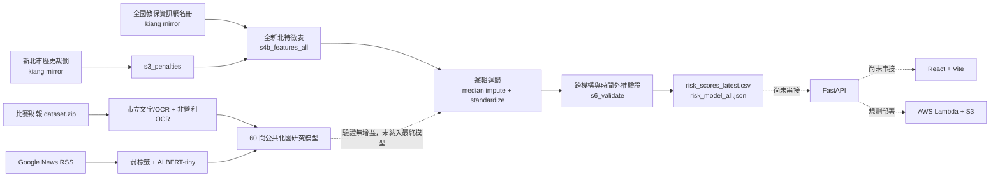

# 小小守護員 Smart Watchdog 技術文件

- 文件版本：1.0
- 整理日期：2026-09-12
- 程式版本：`5cdf2b3`（`main`，Merge pull request #1 from `model-pipeline`）
- 專案名稱：新北市幼兒園風險預警系統

> 本文件依目前 repository 的實際程式碼、模型報告與設定整理。功能狀態分為「已實作」、「程式骨架」與「尚未串接」，不把規劃內容視為已完成成果。

## 1. 文件目的

本文件供開發、模型、前端、後端、部署及簡報人員共同使用，說明：

- 系統目前的架構與技術選型。
- 已完成的 ML pipeline、模型輸入輸出及驗證結果。
- 前端與 API 已建立的介面。
- 模型、API 與前端之間尚未完成的整合。
- 本機重現、部署與資料授權限制。

## 2. 系統定位

小小守護員是提供主管機關與稽查人員使用的風險排序工具。系統利用公開的園所名冊與歷史裁罰資料，估計園所下一年度遭裁罰的風險，產生優先稽查名單及主要風險因素。

模型輸出屬於異常指標與資源分配輔助依據，不是行政裁決、違法認定或因果推論。高風險項目仍須由專業人員比對原始紀錄並進行現場查核。

## 3. 目前版本摘要

| 子系統 | 狀態 | 目前內容 |
| --- | --- | --- |
| 全新北風險模型 | 已實作 | 名冊與歷史裁罰特徵、跨機構驗證、時間外推驗證、Platt 機率校正、風險分數輸出 |
| 財報解析研究管線 | 已實作 | 市立決算書文字與 OCR 解析、非營利園財報 OCR、逐列及合計驗算 |
| 輿情研究管線 | 已實作 | Google News RSS、弱標籤、ALBERT-tiny 多標籤分類及園所年度彙總 |
| 模型產物 | 可重建，未納入 repo | CSV、Joblib、可攜式 JSON、驗證 JSON 受資料授權限制，不提交版本庫 |
| FastAPI | 程式骨架 | 路由、Pydantic schema、CORS 與 Lambda handler 已建立；業務端點仍回傳空資料或固定值 |
| React 前端 | 畫面骨架 | 五個頁面、導覽與版面完成；尚未使用 API client 載入真實資料 |
| AWS 部署 | 程式骨架 | bootstrap 與 deploy CLI 尚為 stub，部署函式回傳 mock URL |
| 端到端系統 | 尚未完成 | ML 輸出尚未轉換為 API response，前端尚未顯示實際模型結果 |

## 4. 系統架構



最終上線建議採離線批次評分：定期重建 `risk_scores_latest.csv`，由 API 載入分數檔提供查詢。一般請求不需要即時載入或訓練模型。

## 5. 技術棧

### 5.1 模型與資料處理

- Python 3.10+
- pandas、NumPy
- scikit-learn
- XGBoost（候選模型與 SageMaker 實驗）
- pypdfium2
- RapidOCR / ONNX Runtime
- PyTorch、Transformers
- boto3（選用的 SageMaker 流程）

### 5.2 後端

- FastAPI
- Pydantic 2
- Uvicorn
- Mangum
- PyYAML
- pandas、PyArrow
- boto3

### 5.3 前端

- React 18
- TypeScript
- Vite 5
- Tailwind CSS 3
- React Router 6
- Recharts
- Lucide React

### 5.4 目標基礎設施

- AWS Lambda Function URL
- Amazon S3
- Amazon SageMaker（選用，尚未驗證）
- Amazon Bedrock（規劃項目，目前無實作）

## 6. Repository 結構

```text
.
├── api/                    FastAPI 應用、schema 與路由骨架
│   ├── main.py             應用初始化、CORS、router 註冊
│   ├── handler.py          Mangum Lambda entrypoint
│   ├── config.py           config.yaml 載入器
│   ├── schemas.py          Pydantic API 契約
│   └── routes/             health、institutions、rankings 等端點
├── infra/                  AWS bootstrap 與 deploy stub
├── ml/                     已實作的資料、訓練與驗證專案
│   ├── pipeline/           s1 至 s6、NLP 與共用解析工具
│   ├── docs/               模型驗證報告
│   ├── data/README.md      資料產物與執行順序
│   └── USAGE.md            最終模型操作指南
├── pipeline/               早期預留套件，目前只有空骨架
├── web/                    React 前端
├── config.yaml             AWS、舊版模型權重與 API 設定
├── Makefile                安裝、啟動與 build 指令
├── NOTICE.md               第三方來源與授權說明
└── outputs/                專案整理文件輸出
```

目前有兩個名為 pipeline 的區域。實際 ML 實作位於 `ml/pipeline/`；repository 根目錄的 `pipeline/` 尚未包含處理邏輯。開發與部署時應避免匯入錯誤路徑。

## 7. ML Pipeline

### 7.1 建議的最終模型流程

在 `ml/` 目錄執行：

```bash
python -m pipeline.s3_penalties
python -m pipeline.s4b_features_all
python -m pipeline.s6_validate
```

流程說明：

1. `s3_penalties` 從 kiang 的全國教保資訊網鏡像下載新北市裁罰紀錄，依園所、公文號及違規內容去重，移除負責人姓名並保留可重現的日期快照。
2. `s4b_features_all` 將園所名冊與裁罰歷史展開成「園所 × 年度」訓練表。第 t 年特徵預測第 t+1 年是否遭裁罰。
3. `s6_validate` 執行跨機構交叉驗證、時間外推驗證、Platt 機率校正，訓練最終模型並輸出最新年度分數。

最終模型不依賴比賽財報 `dataset.zip`、OCR 或輿情資料；重建裁罰資料時需要網路。

### 7.2 全新北模型特徵

| 特徵 | 說明 |
| --- | --- |
| `prior_penalties` | 第 t 年以前含當年的累積裁罰次數 |
| `penalized_this_year` | 第 t 年是否遭裁罰 |
| `years_since_penalty` | 距最近一次裁罰的年數；無紀錄時為 99 |
| `capacity` | 核定收托人數 |
| `monthly_fee` | 名冊中的月費 |
| `age` | 立案年數 |
| `private` | 是否為私立園 |
| `nonprofit` | 是否為非營利園 |
| `after_care` | 是否提供延長照顧 |
| `pre_public` | 是否為準公共化園所 |

名冊屬性是目前快照，不一定代表歷史年度當時狀態。`is_active` 刻意排除，避免園所在受罰後停業造成未來資訊洩漏。

### 7.3 最終模型

模型 pipeline：

```text
缺值中位數補值 → StandardScaler → LogisticRegression
```

主要參數：

- `C=0.3`
- `class_weight="balanced"`
- `max_iter=5000`
- 以園所 ID 作為 group，避免同一園所同時進入訓練與驗證折。

模型先產生排序分數，再使用 out-of-fold 分數擬合單一 Platt sigmoid，將 class-weighted 模型輸出轉換為較接近實際裁罰率的機率：

```text
x = 原始特徵，缺值以各欄中位數取代
z = (x - mean) / scale
rank_score = sigmoid(intercept + coef · z)
risk_probability = sigmoid(platt_a × logit(rank_score) + platt_b)
```

兩種操作門檻：

- `screen_flag`：以訓練資料決定可涵蓋 90% 正樣本的排序門檻，目標是降低漏報。
- `priority_flag`：每年度排序前 10%，目標是提供有限稽查資源的優先名單。

### 7.4 驗證方法與目前報告結果

驗證結果來自版本庫中的 `ml/docs/MODEL_REPORT.md`。本次文件整理未重新執行訓練，因此下列數字是已提交報告中的可重現結果。

| 驗證方式 | AUC | 95% 信賴區間 |
| --- | ---: | ---: |
| 跨機構交叉驗證 | 0.688 | 0.666–0.707 |
| 時間外推（2023–2024） | 0.640 | 0.601–0.676 |

跨機構驗證使用 `StratifiedGroupKFold` 5 折 × 5 次重複，信賴區間以園所為單位 bootstrap 1,000 次。時間外推以 2018–2022 訓練、2023–2024 測試，測試年度不參與門檻選擇。

| 操作點 | Recall | Precision | 列入比例 | 解讀 |
| --- | ---: | ---: | ---: | --- |
| 跨機構篩檢門檻 | 90.0% | 11.3% | 66.8% | 降低漏報，但名單很大 |
| 跨機構前 10% | 23.3% | 19.7% | 10.0% | 命中率約為基準率 8.4% 的 2.3 倍 |
| 時間外推篩檢門檻 | 82.5% | 10.5% | 70.0% | 近年資料分布已有變化 |
| 時間外推前 10% | 20.8% | 18.4% | 10.0% | 未見年度仍保有排序效益 |

限制：分類型 AUC 顯示公共化園內部訊號不足，報告中的私立、公立、非營利 AUC 分別為 0.592、0.556、0.374。因此不可宣稱模型適合對公共化園進行可靠的內部排序。

### 7.5 模型輸出

| 檔案 | 用途 |
| --- | --- |
| `ml/data/processed/risk_scores_latest.csv` | 網站與 API 建議使用的最新園所分數 |
| `ml/models/risk_model_all.joblib` | Python 推論模型、校正參數與門檻 |
| `ml/models/risk_model_all.json` | 可由 JavaScript、Java、SQL 等環境重現的模型參數與公式 |
| `ml/models/validation_all.json` | AUC、混淆矩陣、分群結果、係數與最新評分摘要 |

`risk_scores_latest.csv` 主要欄位：

| 欄位 | 說明 |
| --- | --- |
| `group` | 園所類型 |
| `inst` | 園所名稱 |
| `period` | 用來評分的資料年度 |
| `predicts_year` | 預測目標年度 |
| `risk_probability` | Platt 校正後的隔年裁罰機率 |
| `percentile` | 全新北風險百分位 |
| `screen_flag` | 廣泛篩檢旗標 |
| `priority_flag` | 年度前 10% 優先旗標 |
| `top_factors` | 對該筆排序分數產生最大正向貢獻的前三項特徵 |

### 7.6 完整研究流程

需要重做財報與輿情實驗時，執行：

```bash
python -m pipeline.s1_city
python -m pipeline.s2_nonprofit
python -m pipeline.s3_penalties
python -m pipeline.nlp.collect
python -m pipeline.nlp.train
python -m pipeline.nlp.aggregate
python -m pipeline.s4_features
python -m pipeline.s5_train
```

研究結論：60 間公共化園的財報與輿情特徵未呈現可用的隔年裁罰預測力；與全新北模型混合亦未改善結果。因此這些資訊保留作為研究或解釋層，未納入最終模型。

## 8. 後端 API

### 8.1 應用結構

`api/main.py` 建立 FastAPI app、讀取 `config.yaml`、設定 CORS 並註冊所有 router。`api/handler.py` 使用 Mangum 提供 Lambda entrypoint。

本機預設位址：

- API：`http://localhost:8000`
- Swagger UI：`http://localhost:8000/docs`
- OpenAPI JSON：`http://localhost:8000/openapi.json`

### 8.2 端點現況

| 方法 | 路徑 | 契約用途 | 目前實際行為 |
| --- | --- | --- | --- |
| GET | `/` | 服務資訊 | 回傳服務名稱、文件位置及 online 狀態 |
| GET | `/api/health` | 資料新鮮度與覆蓋率 | 回傳硬編碼示例值 |
| GET | `/api/institutions` | 園所清單，可依 group 篩選 | 回傳空陣列 |
| GET | `/api/institutions/{inst_id}` | 園所詳情 | 回傳占位名稱、0 分及空明細 |
| GET | `/api/rankings` | 年度、group、最低分數排名 | `total=0`、`items=[]` |
| GET | `/api/accounts/{inst_id}/{year}` | 財務科目明細 | 回傳空 items |
| GET | `/api/opinion/{inst_id}` | 園所輿情 | 回傳零覆蓋及空文件 |
| POST | `/api/whatif` | 自訂權重重算 | 原樣回傳權重，items 為空 |

### 8.3 已定義的主要 schema

- `InstitutionListItem`：園所 ID、名稱、群組、分數、裁罰數、風險等級、地址與經緯度。
- `InstitutionDetail`：歷史分數、SHAP、規則旗標、裁罰、輿情數量與來源網址。
- `RankingsResponse`：年度、群組、總筆數及排名項目。
- `AccountStatementResponse`：園所、會計年度、預決算科目與來源頁碼。
- `OpinionResponse`：輿情風險、覆蓋率、主題分布與文件。
- `WhatIfRequest/Response`：五項舊版權重及重算後排名。

### 8.4 模型與 API 的必要轉換

目前 ML 與 API 契約尚未一致，至少需要下列 adapter：

| ML 欄位 | 建議 API 對應 | 轉換規則 |
| --- | --- | --- |
| `inst` | `name` | 直接映射 |
| `inst` 或新增穩定 ID | `id` | 目前全新北表以完整名稱作 `inst_id`，應建立穩定識別碼策略 |
| `group` | `peer_group` | 統一私立、公立、非營利等列舉值 |
| `predicts_year` | `academic_year` | 確認使用西元年或民國學年度，避免語意混用 |
| `risk_probability` | 新增同名欄位 | 建議保留 0–1 機率，不直接冒充 0–100 綜合分數 |
| `percentile` | 新增 `percentile` | 可用於前端排序及相對風險呈現 |
| `priority_flag` | 新增 `priority_flag` | 對應年度前 10% 優先稽查名單 |
| `screen_flag` | 新增 `screen_flag` | 對應廣泛篩檢名單 |
| `top_factors` | `shap_breakdown` 的替代或新欄位 | 目前是線性模型正向貢獻，不應標示為 XGBoost SHAP |

## 9. 前端

### 9.1 路由

| 路徑 | 頁面 | 目前狀態 |
| --- | --- | --- |
| `/` | 風險排行 | 篩選與搜尋版面完成，CSV 按鈕停用，無資料列 |
| `/map` | 風險地圖 | 地圖與圖層占位，尚未載入座標或地圖元件 |
| `/i/:id` | 園所詳情 | SHAP、財務、裁罰與輿情區塊為占位內容 |
| `/sandbox` | 權重沙盒 | 五項滑桿與重算按鈕停用 |
| `/method` | 模型方法論 | 靜態方法論內容可顯示，但仍描述舊版模型 |

未匹配路由會導回 `/`。

### 9.2 API Client

`web/src/services/api.ts` 已封裝：

- `getHealth`
- `getInstitutions`
- `getInstitutionDetail`
- `getRankings`
- `getAccounts`
- `getOpinion`
- `postWhatIf`

開發環境透過 Vite 將 `/api` proxy 至 `http://localhost:8000`。目前各 page 尚未呼叫這些方法。

### 9.3 前端整合要求

每個資料頁至少需要處理：

- loading、success、empty、error 四種狀態。
- 年度及園所類型篩選。
- 園所名稱與穩定 ID 的 URL encoding。
- `risk_probability` 與 `percentile` 的清楚標示。
- 無資料與低風險的語意區分。
- 模型限制、資料擷取日期及原始來源。

## 10. 舊版五因子設計與最新模型的差異

這是目前最重要的文件與實作落差。

`README.md`、`config.yaml`、API what-if schema 及前端方法論頁仍描述：

```text
45% 裁罰預測 + 20% 預決算殘差 + 15% Isolation Forest
+ 10% 輿情風險 + 10% 規則旗標
```

最新 `ml/pipeline/s6_validate.py` 的正式產物則是名冊與歷史裁罰特徵的校正邏輯迴歸模型。財報與輿情經驗證未帶來預測增益，因此未加入最終模型。

在整合前，團隊需要選擇並統一產品定義。依目前驗證證據，建議：

1. 排行主分數採 `risk_probability` 與 `percentile`。
2. `priority_flag` 作為優先稽查名單。
3. 財報異常與輿情作為獨立的查核線索，不混入已校正機率。
4. 方法論頁改寫為邏輯迴歸、Platt 校正及兩種操作門檻。
5. 移除或重新定義 what-if 五權重功能；否則其結果無法與已驗證模型對應。

## 11. 設定

根目錄 `config.yaml` 目前包含：

- AWS region：`us-west-2`
- AWS profile：`workshop`
- S3 bucket placeholder：`kiro-workshop-default`
- SageMaker role placeholder ARN
- S3 prefix：`raw/`、`curated/`、`features/`、`models/`、`scores/`、`opinion/`、`web/`
- 舊版五因子權重
- API host、port 與 CORS origins

正式部署前必須把 bucket、role ARN 與 CORS 改為實際環境值。CORS 不應同時使用 credentials 與萬用來源 `*`。

## 12. 本機開發

### 12.1 前置需求

- Python 3.10+
- Node.js 20+
- npm
- GNU Make（選用）

### 12.2 安裝

```bash
python -m venv .venv

# Windows PowerShell
.venv\Scripts\Activate.ps1

# macOS / Linux
source .venv/bin/activate

pip install -r requirements.txt
cd web
npm install
cd ..
```

只執行最終模型時，在 `ml/` 另依 `ml/USAGE.md` 安裝最小相依套件。

### 12.3 啟動

```bash
# Terminal 1
make run-backend

# Terminal 2
make run-frontend
```

或直接執行：

```bash
uvicorn api.main:app --host 0.0.0.0 --port 8000 --reload
cd web && npm run dev
```

開啟 `http://localhost:5173`。

### 12.4 Build

```bash
make build-frontend
```

## 13. AWS 部署現況

目標架構是將 FastAPI 包裝為 Lambda Function URL，並從 S3 載入 Parquet 或分數檔。現況如下：

- `api/handler.py` 的 Mangum handler 已存在。
- `api/main.py` lifespan 只有 S3 cold-start cache 的預留註解。
- `infra/bootstrap.py` 只記錄 STUB log，沒有執行 STS、S3、IAM 或 Bedrock 檢查。
- `infra/deploy_api.py` 沒有打包或部署 Lambda，回傳的是 mock URL。
- SageMaker 選項只支援 XGBoost；最新正式模型是邏輯迴歸，且 SageMaker 路徑尚未實測。

因此不可把目前版本描述為已部署 AWS。

## 14. 資料、隱私與授權

依 `NOTICE.md`：

- 比賽 `dataset.zip` 未說明再散布條件，原始檔與衍生 CSV 不進公開 repo。
- 全國教保資訊網未找到開放授權宣告；抓取結果不納入 repo，畫面應註明來源與擷取日期。
- kiang mirror 採 MIT License；目前由 pipeline 執行時下載。
- Google News 標題只在本機分析，不散布。
- CKIP ALBERT-tiny 採 GPL-3.0；微調權重不得提交或散布。
- 裁罰輸出不包含負責人姓名。
- repository 自有程式碼目前尚未選定 LICENSE。

下列目錄已由 `ml/.gitignore` 排除：

- `ml/data/processed/`
- `ml/data/labels/`
- `ml/models/`

若要部署 demo，模型結果應存放於私有 S3 或受控的內部儲存空間。

## 15. 已知限制與技術債

1. ML 輸出尚未接入 API。
2. API response schema 與最終模型欄位及模型語意不一致。
3. 前端頁面尚未呼叫已建立的 API client。
4. README、方法論頁與 what-if 仍呈現舊版五因子模型。
5. 園所穩定 ID、園所名稱正規化與年度定義尚未統一。
6. 全新北名冊屬性是當前快照，存在歷史欄位偏差。
7. 2024 分年 AUC 下降，需監測資料漂移。
8. 模型對公立與非營利園的內部排序不可靠。
9. API health 指標為硬編碼值，不能代表真實資料品質。
10. AWS bootstrap、S3 cache 及 Lambda deploy 尚未實作。
11. 根目錄 `pipeline/` 與 `ml/pipeline/` 名稱重複，容易造成匯入或操作錯誤。
12. 目前沒有自動化測試或 CI 設定。

## 16. 建議整合順序

### P0：形成可展示的端到端主線

1. 執行 ML 最小流程，產生 `risk_scores_latest.csv`。
2. 決定園所穩定 ID、年度與 group 的共同格式。
3. 新增後端 repository/service，啟動時載入分數 CSV 或 Parquet。
4. 先實作 `/api/rankings` 與 `/api/institutions/{id}`。
5. 更新 Pydantic 與 TypeScript 型別，以 `risk_probability`、`percentile`、`screen_flag`、`priority_flag` 為核心。
6. 排行頁串接 API，完成 loading、empty、error 與篩選。
7. 更新方法論頁，與最新模型報告一致。

### P1：補齊查核資訊

1. 串接裁罰歷程。
2. 加入地址與座標，完成風險地圖。
3. 把財報異常及輿情呈現為獨立證據區塊。
4. 完成 CSV 匯出與資料更新時間。

### P2：部署與維運

1. 實作 S3 artifact 上傳與版本資訊。
2. 實作 Lambda 打包、部署與最小權限 IAM。
3. 增加資料 schema 驗證、API 測試與前端 build CI。
4. 建立季度重訓、驗證閘門與資料漂移監測。

## 17. 驗收基準

端到端 demo 可視為完成時，至少符合：

- 可從同一版模型產物取得園所排名。
- API 回傳的總筆數、年度與前端顯示一致。
- 使用者可以從排名進入園所詳情。
- 畫面清楚區分風險機率、百分位與操作旗標。
- 主要風險因素可追溯至模型欄位或裁罰資料。
- 無資料時不顯示為低風險。
- 方法論頁與 `MODEL_REPORT.md` 使用同一模型與同一組驗證數字。
- 重啟服務後可載入同一版 artifact。
- 不公開提交受限制的原始資料、衍生資料或模型檔。

## 18. 本次文件整理的驗證範圍

本次已執行：

- `api/`、`infra/` 與 `ml/pipeline/` Python 語法編譯檢查：通過。
- React/TypeScript production build：通過。
- Vite 本機服務 HTTP 檢查：`200 OK`。
- API、前端、ML 與部署程式碼的靜態盤點。

本次未執行：

- ML pipeline 重訓與數值重算：本機未找到 `dataset.zip`、processed data 或 model artifacts。
- FastAPI runtime 測試：目前系統 Python 未安裝專案後端套件。
- AWS 部署：部署工具為 stub，且未使用 AWS credentials。

## 19. 參考文件

- `README.md`：專案原始架構與舊版五因子設計。
- `ml/USAGE.md`：最終模型執行及移植方式。
- `ml/docs/MODEL_REPORT.md`：模型驗證方法、結果與限制。
- `ml/data/README.md`：資料處理順序、輸出及欄位。
- `NOTICE.md`：第三方資料、模型及套件授權。
- `api/schemas.py`：API response 契約。
- `web/src/types/api.ts`：前端 TypeScript 契約。
